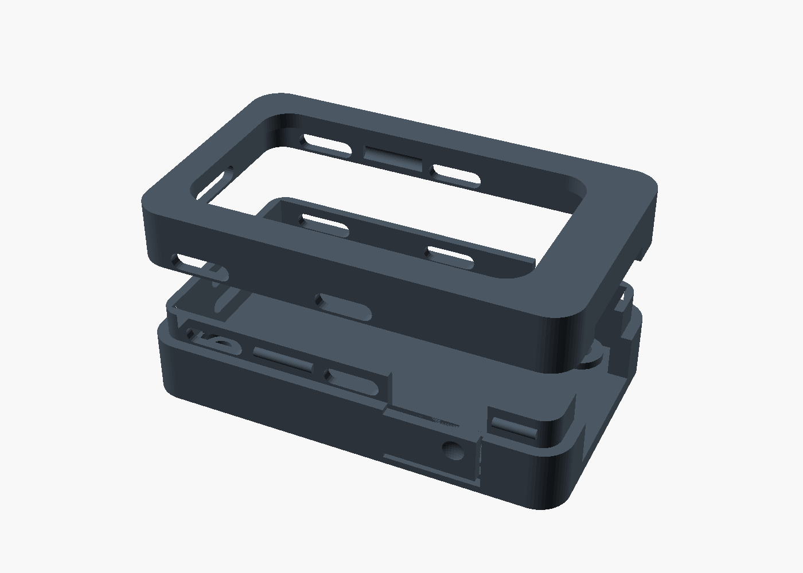
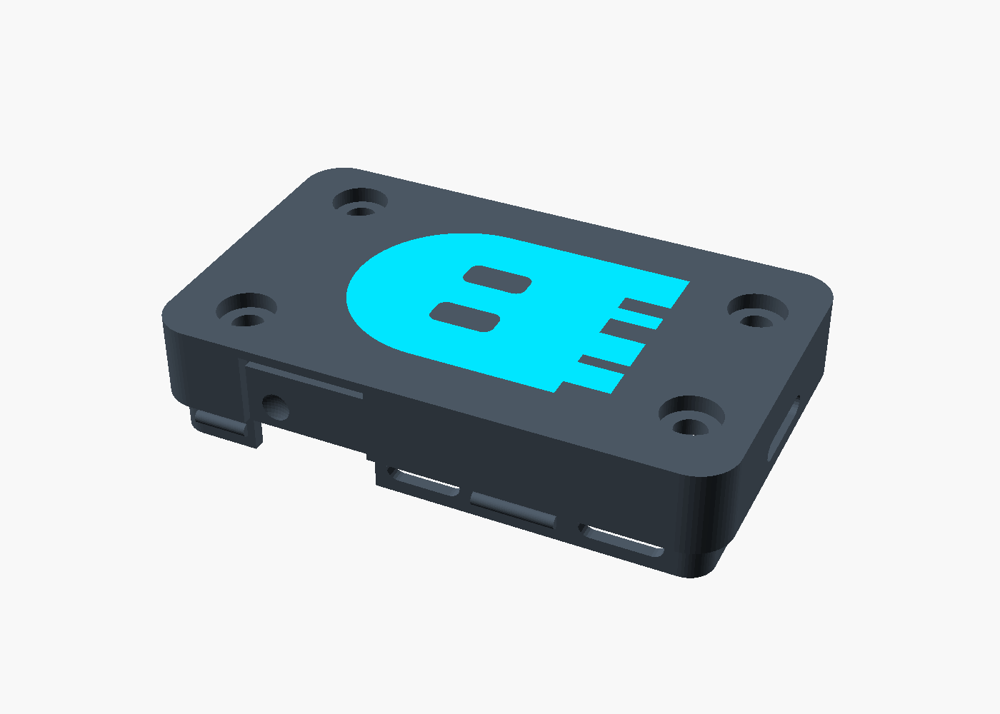
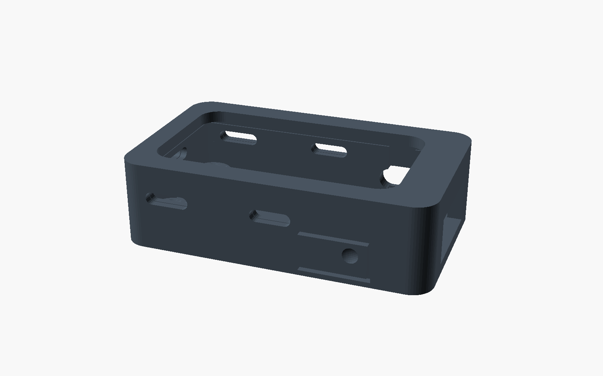

# GhostHID case (Waveshare ESP32-S3-LCD-1.47)

A parametric two-part case for the board GhostHID runs on. That board is a
**USB-A stick**: the male USB-A plug is part of the PCB and pokes out one short
end, the 1.47" LCD is on the front, and the ESP32-S3 + side-actuated BOOT/RST
buttons are on the back / edges.



- **bottom** — cradles the back (component) side. Four **bosses** land on the M2
  nuts the board already carries on its back — two of them **socket** the nuts
  to locate the board — and **M2×4 screws** through the floor hold it; the USB
  end is open for the plug (and card, if fitted); a flush **BOOT paddle** in
  one side wall and a small **RST slot** in the other, each with an entry
  channel so the board drops straight in; a logo-shaped pocket in the floor
  takes the inlay.
- **top** — a bezel that clips onto the bottom's lip and frames the LCD active
  area with a rounded-corner window (R2.8, matching the panel).
- **logo** — the **GhostHID ghost mark** (traced from `assets/mark.svg` — the
  square-wave "pulse" hem and pill eyes), centred on the back as an inlay that
  fills the pocket flush, printed in a second colour.



## Dimensions — measured off Waveshare's STEP model

Everything is measured from Waveshare's STEP (`esp32-s3-lcd-1_47_asm.stp`, in
their `ESP32-S3-LCD-1.47_Structural_Drawings.zip`) and cross-checked against
`waveshare-structural-drawing.pdf` (in this folder) and the LBS147TC-IF15 LCD
datasheet. Board frame: x along the length from the non-USB end, y across, z
from the PCB *front* face.

| feature            | value                                                          |
|--------------------|----------------------------------------------------------------|
| PCB                | 36.39 × 20.34 × **0.8** mm, R2.8 corners                        |
| LCD stack          | **4.25 mm** proud of the front (2.8 spacer + 1.45 glass); module 36.28 × 19.39, reaches x 37.01 — 0.62 mm *past* the USB end |
| LCD active area    | 32.35 × 17.39 at x 1.00–33.35, y 1.47–18.86 (1 mm off-centre toward the non-USB end) |
| mounting           | 4 × Ø2.25 holes with SMT **M2 nuts** standing 2.51 mm off the back, at (1.98, 3.53) (1.98, 16.81) (33.98, 2.01) (33.98, 18.33) — 32.0 pitch along, 13.28 across at the non-USB end, 16.32 at the USB end |
| tallest back part  | TF slot, 2.90 mm (USB shell 2.19, nuts 2.51)                    |
| BOOT / RST         | bodies x 27.07–31.62, z −2.6 to −0.4, protrude 1.19 mm past both long edges; actuator tip 1.8 × 0.8 at x 29.35, z −1.7. BOOT on the y = 0 edge, RST on y = 20.34 |
| USB-A plug         | 12.0 wide × 4.5 tall (z −2.99 to +1.51), starts 2.8 mm inboard   |
| case outer         | 41.8 × 25.1 × 11.9 mm                                            |

(The structural drawing is easy to misread: its "29.3" is the button offset and
"16.32" is the USB-end hole pitch, neither is a PCB dimension — the earlier
revision of this case did exactly that and didn't fit.)

The only judgement calls are clearances, flagged `[tune]` in the `.scad`:

- `back_h` (3.3) — cavity depth behind the PCB; the TF slot needs 2.9. The
  bosses are derived from it (`back_h − nut_h`), so it also sets where the board
  sits — change it and the board moves with it.
- `clr` / `end_clr` / `top_clr` — PCB side clearance, extra room at the USB end
  for the LCD overhang, air over the glass. Checked at 0.4 / 1.0 / 0.3 against
  the STEP with zero interference.

## Buttons



The firmware uses **BOOT**, so it gets a proper button: a 9 × 4.5 mm patch of
the side wall is cut free on three sides and left hinged along its non-USB end,
so it works as a flush paddle — press anywhere on it (the dimple marks the
actuator, near the free end for leverage). It is a 1.0 mm PLA flexure with 0.21
mm of free travel before it meets the switch, then the switch's own 0.25 mm; the
hinge is a vertical strip, so it bends along the print layers rather than across
them. **RST** only needs a fingernail, so it keeps a plain 5.6 × 3.2 slot.

Which wall is which: on the board, with the **screen toward you and the USB
plug pointing up, BOOT is on the right edge**. The model puts it on the y = 0
wall (`boot_side = 0`, the wall facing you in the previews); set `boot_side = 1`
if a board revision swaps them, or `boot_paddle = false` for a plain slot.

## Getting the board in and out

The switch actuators poke 0.8 mm *into* the walls, so a plain cavity traps the
board — it has to be forced in past solid wall and forced back out (which is
how switches get broken). Each switch therefore has an **entry channel**: a
groove in the inner face of the wall from the switch up through the lip, so the
actuators ride straight down into place. On the BOOT side the paddle's pocket
is the channel; on the RST side it is a 3.8 mm groove behind the wall.

Drop the board in **straight down, LCD up, USB plug toward the open end**. The
two nuts at the non‑USB end fall into **sockets** on their bosses (funnelled, so
they self-centre) — that locates the board even with no screws fitted, which
also keeps the BOOT paddle's 0.2 mm gap consistent. To take it out, lift it
straight up by the USB plug; if it's snug, push a toothpick through a screw
hole from the back — it lands on the nut, not on the PCB.

## RGB glow

The board's RGB LED is a side-firing bead at the middle of the non-USB end (on
the back, pointing out through the PCB edge), and the transparent acrylic
spacer under the LCD carries its glow around the display. Slots let it out: two
on the end wall — one straight in front of the LED, one at acrylic height — and
two per long side at acrylic height (`glow_side_x`). They cut through the lid's
skin and the bottom's lip; `glow = false` closes them all.

## Hardware

4 × **M2×4** pan-head screws (M2×3 also works). The board's nuts span the PCB, so
an M2×5 would poke through into the LCD spacer — don't. Heads sit ~0.4 mm proud
of the 1.2 mm counterbores.

## Print it

Pre-exported STLs are in this folder, or regenerate after editing:

```sh
openscad -D 'part="bottom"' -o ghosthid-bottom.stl ghosthid-case.scad
openscad -D 'part="logo"'   -o ghosthid-logo.stl   ghosthid-case.scad   # second colour
openscad -D 'part="top"'    -o ghosthid-top.stl    ghosthid-case.scad
openscad -D 'part="both"'   -o preview.png         ghosthid-case.scad
```

**Two-colour bottom, the easy way:** open **`ghosthid-case.3mf`** — one file,
three parts already aligned ("bottom", "logo", "top"), each carrying its own
material. Pick a filament for the logo and print flat. Regenerate with:

```sh
openscad --enable=lazy-union --backend=Manifold \
         -D 'part="3mf"' -o ghosthid-case.3mf ghosthid-case.scad
```

Prefer STLs? Load `ghosthid-bottom.stl` + `ghosthid-logo.stl` together (they share
coordinates, so they line up) and assign the logo the second filament. The inlay
is `logo_depth` (0.8 mm) deep. No multi-material printer? The pocket still reads
fine in one colour, or paint it in the slicer.

The top bezel (`ghosthid-top.stl`) is a separate single-colour print.

| setting        | value                                                    |
|----------------|----------------------------------------------------------|
| material       | PLA (both colours)                                       |
| layer height   | 0.16–0.20 mm                                              |
| walls          | 3 perimeters                                              |
| infill         | 20 %                                                      |
| supports       | none — both parts print flat                              |
| orientation    | bottom: floor down · top: **window-face down** (the `part="top"` output is already flipped for this) |

The halves locate on a lip inside the wall thickness and click shut on two
detents per side (`snap_r`); nudge `lip_clr` and reprint the top only if it's
tight or loose.

## Note for boards with headers soldered

This is drawn for the **bare-pad** board (no pin headers). If your board has the
male headers fitted, the pins reach 9.3 mm below the back and this case won't
close — raise `back_h` to clear them, or leave them off.

There is no official Waveshare case and no community model carries the GhostHID
mark, which is why this is built from scratch off the STEP model.
